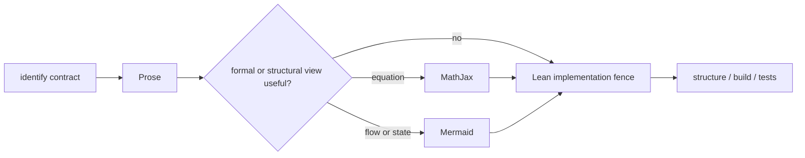

# Agent instructions

## Lean visibility and import policy

1. `public section` is forbidden. Do not use it directly or through a construct such as `@[expose] public section`.
2. Every exported declaration must be marked `public` explicitly on that declaration. Do not rely on section-wide visibility.
3. `public import` is allowed only in designated public API or umbrella modules. A module that defines `public` declarations is a designated API module only for the direct dependencies required by those declarations' exported signatures.

   Designated public modules are the root and domain façades, `Meta.Important`, the public leaves
   under `Automata`, `Grammar`, and `Lambek.ProductFree`, and their direct public submodules.
   A module below an `Internal` directory is never a designated public module.
4. Implementation modules must use ordinary `import` declarations by default. In an API module, use `public import` only for a dependency whose exported declaration, type, instance, syntax, or attribute is required by the module's public interface; document non-obvious cases.
5. `import all` and importing an `All` umbrella module are forbidden except in proof modules, test modules, or modules explicitly documented as internal. The root façade imports leaf APIs directly.
6. Every use of `@[expose]` requires an explicit adjacent justification explaining why reducibility across the module boundary is necessary.

## LiterateLean is mandatory

Every project-owned Lean source module must be written as a LiterateLean document. This applies to the root façade, tests, examples, smoke modules, and every module under `Mathling/`. It does not apply to `lakefile.toml`, generated files, or vendored fixtures.

For every affected `.lean` file:

1. Import `LiterateLean` directly. Do not rely on a transitive import.
2. Open `LiterateLean` explicitly with `open scoped LiterateLean`.
3. Indent the executable header by four spaces so it is valid Lean and renders as an implicit Markdown code block.
4. Give the document one level-one heading that states the module's purpose.
5. Put explanatory Markdown prose outside Lean fences. Explain contracts, invariants, data flow, failure behavior, and architectural boundaries—not a line-by-line paraphrase of the code.
6. Put executable declarations only inside explicit ```lean` fences. Namespace and section commands, including every matching `end`, must remain inside Lean fences.
7. Split large modules into coherent sections with prose between fences. Do not hide an entire production module in one monolithic fence merely to satisfy the syntax.
8. Keep prose synchronized with implementation changes. In particular, describe the canonical `Mathling` API, conversion pipeline, and any shared execution or normalization story accurately; do not revive obsolete internal-control-flow descriptions.
9. Use MathJax for type, shape, algebraic, and invariant relationships, and Mermaid for data flow, state transitions, dependency boundaries, and execution phases. Add a visual only when it makes the contract easier to scan; keep prose beside it so the document remains understandable when diagram rendering is unavailable.

The documentation workflow is:



10. End the file, after the final closing Lean fence, with exactly this Markdown footer:

```text
<!--
vim: set filetype=markdown :
Local Variables:
mode: markdown
End:
-->
```

The footer is prose. Never place it inside a Lean fence, and never append a second copy.

## Required checks

After changing LiterateLean structure or prose:

- Check that every opening fence is paired, headings do not skip levels, no Lean command escaped a fence, and the canonical footer is the final non-whitespace content.
- Run `Scripts/check_literatelean.sh` and `Scripts/check_visibility_policy.sh`.
- Run `lake build Mathling mathlingTests`.
- Run `lake test` when executable behavior or test sources changed.
- Compile changed files that are outside Lake targets with `lake env lean <file>`. If the repository gains standalone smoke or scratch modules that are not imported by `Mathling.lean` or exercised by `mathlingTests`, list them here explicitly and check them directly.

A successful build does not excuse malformed Markdown, stale prose, missing standalone checks, or a footer inside executable code.

## GitHub Markdown Math Compatibility

When generating Markdown intended for GitHub, treat GitHub math as a restricted, Markdown-sensitive MathJax environment. A formula rendering correctly in standalone MathJax, KaTeX, Jupyter, or LaTeX does not imply that it will render correctly on GitHub.

GitHub's rendered output is the source of truth.

### Preferred delimiters

Use GitHub's backtick-protected syntax for inline mathematics by default:

```md
The result is $`x = \frac{-b \pm \sqrt{b^2-4ac}}{2a}`$.
```

Use a fenced `math` block for display mathematics:

````md
```math
x = \frac{-b \pm \sqrt{b^2-4ac}}{2a}
```
````

Plain `$...$` may be used only for very simple expressions that contain no Markdown-sensitive characters. Avoid `$$...$$` when a fenced `math` block can be used instead.

### Unsupported or unreliable commands

Do not use `\operatorname` or `\operatorname*`. GitHub may leave these commands unrendered even though standalone MathJax accepts them.

Use a built-in operator command when one exists:

```md
$`\min_x f(x)`$
$`\max_x f(x)`$
$`\ker A`$
$`\det A`$
$`\log x`$
```

For a custom upright name that does not require operator-specific spacing or limit placement, use `\mathrm`:

```md
$`\mathrm{Foo}_{x}`$
```

Do not assume that arbitrary MathJax extensions, custom macros, or commands accepted by a local MathJax installation are available on GitHub.

### Backslash escapes and spacing commands

In ordinary `$...$` expressions, GitHub's Markdown processing may consume backslashes before punctuation before the expression reaches MathJax.

This affects constructs such as:

```tex
\,
\:
\;
\!
\{
\}
\$
```

Therefore, do not write:

```md
$a\;b$
$\{a\,b\}$
```

Write:

```md
$`a\;b`$
$`\{a\,b\}`$
```

For display mathematics containing such commands, use a fenced `math` block.

### Delimiter boundaries

Do not concatenate math expressions without intervening whitespace:

```md
<!-- Avoid -->
$\alpha$$\beta$

<!-- Prefer -->
$`\alpha`$ $`\beta`$
```

Do not rely on plain `$...$` recognition when a delimiter is immediately adjacent to letters, digits, quotation marks, brackets, emphasis markers, or other Markdown punctuation.

Prefer whitespace around an inline expression:

```md
Let $`x`$ be an integer.
```

When an expression must be adjacent to punctuation, use the backtick-protected syntax and inspect the rendered GitHub output:

```md
Therefore, $`f(x)=0`$.
```

### Dollar signs

Do not nest dollar-delimited mathematics inside another mathematical expression.

Avoid:

```md
$\text{$\alpha$}$
```

To display a literal dollar sign inside mathematics, use `\$` inside the protected syntax:

```md
$`\sqrt{\$4}`$
```

When prose containing a currency symbol appears on the same line as mathematics, protect the prose dollar sign:

```md
The price is <span>$</span>100, and half of it is $`100/2`$.
```

### Less-than signs and HTML-like text

Do not place raw HTML tags inside mathematical expressions. GitHub may parse them as HTML before MathJax processes them.

Avoid:

```md
$a <b> c$
```

Use mathematical commands or text commands instead:

```md
$`a \lt b`$
$`\text{label}`$
$`\mathrm{label}`$
```

Prefer `\lt`, `\gt`, `\leq`, and `\geq` over raw `<` and `>` when parser ambiguity is possible.

### TeX comments

Do not use `%` comments inside inline mathematics. A comment can consume a newline, delimiter, or closing bracket in a way that interacts badly with Markdown parsing.

Avoid:

```md
$`a + % comment
b`$
```

Write the expression without comments:

```md
$`a+b`$
```

### Markdown nesting

Avoid placing nontrivial mathematics inside the following constructs:

* link labels;
* italic or bold emphasis;
* footnotes;
* `<summary>` elements;
* deeply nested `<details>` elements;
* blockquotes;
* list items with complex indentation.

In particular, do not wrap an inline expression inside Markdown emphasis:

```md
<!-- Avoid -->
*The value is $x$*
**The value is $x$**
```

Separate the prose styling from the expression:

```md
*The value is* $`x`$.
```

Do not place mathematics at the exact end of an emphasized span. Close the emphasis before the expression whenever possible.

Avoid mathematics inside link labels:

```md
<!-- Avoid -->
[$`x`$](target)
```

Use plain link text and place the formula outside the link:

```md
See [the definition](target) of $`x`$.
```

When mathematics is required in a footnote, blockquote, or `<details>` section, use only simple protected inline expressions and verify the result on GitHub. Move display equations to a top-level fenced `math` block whenever possible.

### Indentation

Do not indent mathematical expressions by four or more spaces unless a code block is intended. Markdown indentation may take precedence over math parsing.

Use fenced blocks instead of indentation for display mathematics.

### Large operators and complex layout

Use display mathematics for expressions containing large operators, nested fractions, radicals, or matrices.

Prefer:

````md
```math
\frac{\sum_{i=1}^{n} a_i \prod_{j=1}^{n} b_j}{2}
```
````

rather than forcing such an expression into inline mathematics.

Do not depend on display-sized `\sum` or `\prod` symbols in inline mode.

### Matrices

Put matrices in fenced `math` blocks and place each row on a separate source line:

````md
```math
\begin{pmatrix}
a & b \\
c & d
\end{pmatrix}
```
````

Do not place a multiline matrix in ordinary `$...$` delimiters.

### Expression size and rendering complexity

Keep each mathematical expression reasonably small.

Avoid:

* dozens of repeated `\color` changes in one expression;
* hundreds of braced subscripts or superscripts in one expression;
* very deeply nested fractions or radicals;
* large matrices in inline mode;
* mechanically generated formulas containing excessive grouping.

Split a large formula into multiple fenced `math` blocks or introduce named intermediate expressions.

Color should be used sparingly. Do not rely on a large number of separately colored fragments rendering reliably.

### Validation requirements

When adding or modifying GitHub Markdown mathematics:

1. Prefer $`backtick-protected inline expressions and fenced `math` blocks.
2. Use only simple, widely supported TeX commands.
3. Do not use `\operatorname` or `\operatorname*`.
4. Check for Markdown-sensitive characters, especially `$`, `<`, `>`, `_`, `*`, backslashes before punctuation, and HTML-like text.
5. Inspect the actual rendered file on GitHub after the change.
6. Do not accept a local MathJax or KaTeX preview as proof of GitHub compatibility.
7. If GitHub displays literal TeX or malformed output, simplify the expression rather than adding further macros or escaping layers.
