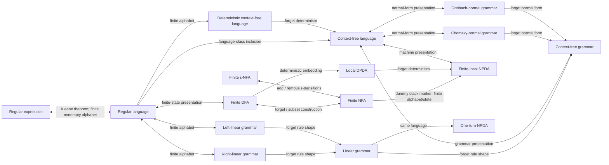

# Mathling

Formalized implementation of the **Lambek Calculus** in Lean 4.

## Overview

This project provides a formalization of the Lambek calculus, a type of substructural logic used in mathematical linguistics. It includes the definition of types, a sequent calculus, and a verified decision procedure.

## Relation map

Mathling also formalizes regular and context-free languages through mutually connected
presentations. Solid double arrows below denote proved language-class equivalences; ordinary
arrows denote language-preserving conversions or inclusions. Finiteness assumptions are shown on
the edges where they are part of the public theorem.



The central verified bridges are:

- [`NFA.toRegex_language`](Mathling/Automata/Regular/Kleene.lean) and
  [`Language.isRegular_iff_hasRegularExpression`](Mathling/Grammar/Regular/Regex.lean) for
  Kleene's theorem;
- `Language.isRegular_iff_exists_rightLinearGrammar` and
  `Language.isRegular_iff_exists_leftLinearGrammar` for regular grammars;
- `Language.isContextFree_iff_exists_npda`,
  `Language.isContextFree_iff_exists_chomskyNormalGrammar`, and
  `Language.isContextFree_iff_exists_greibachNormalGrammar` for context-free presentations;
- `NFA.toNPDA_language`, `DFA.toDPDA_language`, and
  `LinearGrammar.toOneTurnNPDA_language` for language-preserving embeddings.
- `Language.isRegular_iff_εnfa`,
  `Language.IsRegular.isDeterministicContextFree`, and
  `Language.IsDeterministicContextFree.isContextFree` for the ε-NFA and deterministic
  context-free edges.

## Features

- **Syntactic Types**: Implementation of Lambek types:
  - Atomic types: `# "np"`, `# "s"`, etc.
  - Left division: `A ⧹ B` (pronounced "A under B")
  - Right division: `B ⧸ A` (pronounced "B over A")
- **Sequent Calculus**: Formalization of the core sequent rules:
  - Axiom (`ax`)
  - Right and Left rules for both divisions.
- **Cut Admissibility**: A verified proof that the cut rule is admissible, ensuring the consistency and streamlining of the logic.
- **Decidability**: A certified decision procedure that can automatically prove or disprove sequents using `decide`.

## Structure

- `Mathling/Lambek/ProductFree/Basic.lean`: Core definitions for types (`Tp`) and the sequent calculus (`Sequent`). Contains the proof of `cut_admissible`.
- `Mathling/Lambek/ProductFree/Decidable.lean`: Implementation of the verified decision procedure.

## Usage

You can use the `decide` tactic to automatically prove sequents in the Lambek calculus.

```lean
import Mathling.Lambek.ProductFree.All

open Mathling.Lambek.ProductFree

-- An example of a simple derivation: (A / B) , B => A
example : [# "A" ⧸ # "B", # "B"] ⇒ # "A" := by
  decide

-- Another example: A , (A \ B) => B
example : [# "A", # "A" ⧹ # "B"] ⇒ # "B" := by
  decide
```

## Requirements

- Lean 4
- Mathlib 4 (specified in `lakefile.toml`)

<!--
## GitHub configuration

To set up your new GitHub repository, follow these steps:

* Under your repository name, click **Settings**.
* In the **Actions** section of the sidebar, click "General".
* Check the box **Allow GitHub Actions to create and approve pull requests**.
* Click the **Pages** section of the settings sidebar.
* In the **Source** dropdown menu, select "GitHub Actions".

After following the steps above, you can remove this section from the README file.
-->
